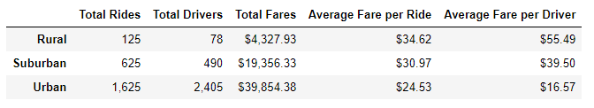
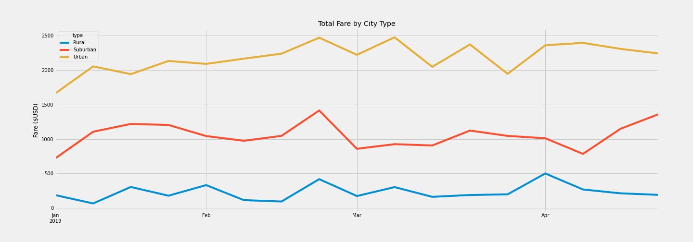

# PyBer_Analysis
## Overview of analysis:
- The purpose of this project was to utilize python, pandas, and matplotlib to create visualizations of ride-sharing data based on city types (rural, urban, suburban). By doing so, we are able to evaluate which sectors generate the most revenue and determine which areas may require more funding. Ultimately, creating graphical visualizations allows management to easily observe spending patterns based on region or time of year.

## Results


Based on the summary dataframe, we can clearly observe that urban areas have the most requested amount of rides, whereas rural areas have the least. However, rural areas have the highest average fare per ride, which can be attributed to having the lowest amount of total drivers (only 78). Suburban areas seem to generate the most value, having an average fare per driver of more than twice that of urban areas, which is largely due to having lower amounts of drivers available (490 total in suburban areas, 2405 in urban). Lastly, it's important to also note that the total number of rides requested in urban areas (1,625) is significantly less than the total available amount of drivers (2,405).



Based on the multiple line graph, we can observe a lower amount of fare generated/demand for rides in early January. The amount made from weekly total fares made slowly increases, particularly in suburban and urban areas from the beginning of January to near the end of the month. In addition, we can note a consistent spike in fare fees in all 3 city types in the last couple weeks of February, which could be a result of school Spring breaks and general increased travelining/driver demand. From March to April, the trends remained relatively consistent except in the urban regions which had larger fluctuations of around $500 per week. Business also performs well after April, demonstrated by the high levels in the line graphs.

Although a quick glance at the visuals may suggest that urban areas are the biggest money-makers, it's important to note that a much deeper analysis could be performed to get a better understanding of the picture. For example, running the following code allows us to find how many cities are in this dataset contributing to each city type group: 
```
# finding the number of cities in each city type
urban_count = pyber_data_df[pyber_data_df['type']=='Urban']

rural_count = pyber_data_df[pyber_data_df['type']=='Rural']

suburban_count = pyber_data_df[pyber_data_df['type']=='Suburban']

# determining number of cities per city group within this dataset
urban_count.city.nunique(), rural_count.city.nunique(), suburban_count.city.nunique()

Output: (66, 18, 36)
```
From the above code, we realize that there are 66 cities in the urban group, 18 in rural, and 36 in suburban. In the time period from 1/1/2019 - 4/29/2019, there were 1,625 total urban rides, 125 rural, and 625 suburban respectively. It would be interesting to dive deeper and determine exactly how many rides were requested, thus determining how much fare amount was generated from each specific city within the city groups. In addition, finding out the average distance and time of day each ride was performed would add additional insight.

## Summary
- 1. Based on these results, I would advise the CEO to increase the number of drivers in all 3 areas during the last 2 weeks of February. Since there is a consistent spike in fares generated during this time, I believe that increasing the number of drivers would decrease wait time to potentially service more customers, allowing us to capture more customers that may go to other ride services due to long waits/high prices.
- 2. I would also recommend shifting some of the total drivers (if employees are open to relocating/working in different areas) from urban areas to suburban/rural. Based on the summary dataframe, there is only a 0.68 total driver/total rides ratio in urban areas. On the other hand, there is a 1.28 ratio and 1.6 ratio in suburban and rural areas respectively. This would also contribute to an increase in average fare per driver in urban areas.
- 3. Since the average fare per ride for rural ($34.62) and suburban ($30.97) areas are quite high while having significantly lower amounts of total rides, increasing marketing and exposure in these areas should contribute to more total fares earned. While demand for ride services may not be as high in these areas as urban cities, the disparity could also be due to other internal or external factors that aggressive marketing could alleviate.    
